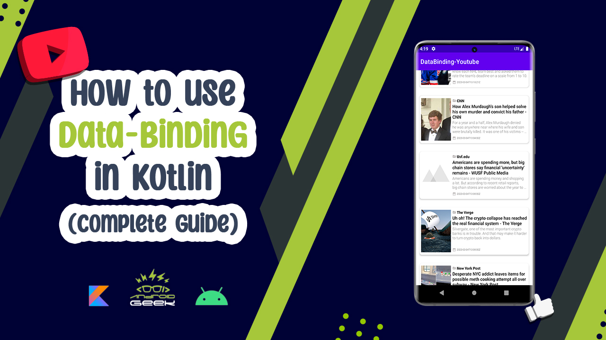
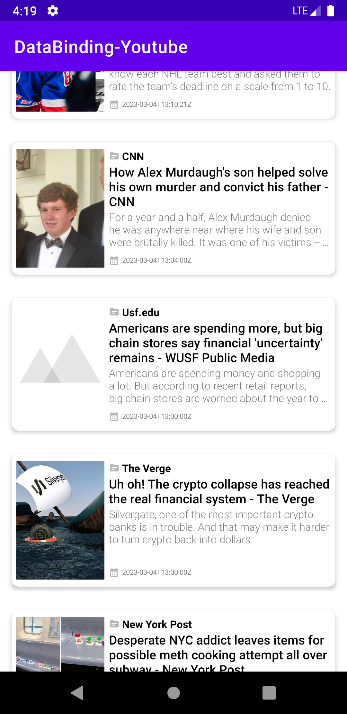
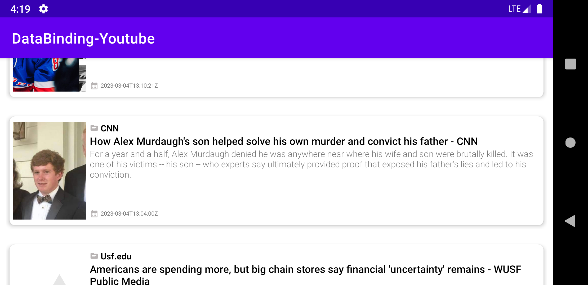

# DataBinding-Youtube
</a>

 
YouTube Video 
  

  

Screen-Shot :
 

 

Article on Medium:
 
https://medium.com/@ezatpanah/how-to-use-data-binding-in-kotlin-complete-guide-83af78a0bb30
 

✨ Join Medium to read thousands of valuable stories ✨
 
https://medium.com/@ezatpanah/membership
